# ADLC in Action — Hands-on

The `handson` branch is a step-by-step workshop. You will learn ADLC by building a game. The repository starts with agent rules, Skills, and a Project Binding. It does not contain the finished game.

Use any coding agent. Build the game, collect evidence, and improve it through two Intents. The workshop takes about two to three hours. Setup time is not included.

**You are the first tester.** Code, tests, and artifacts will appear as you complete each Step.

## What You Will Build

- Intent 1: A number guessing game that a player can finish
- Intent 2: A `Play again` button, followed by a check of second-round starts
- Artifact chain: `intent → spec + plan → code + tests → validation → decision → release → observation → resolution`

```text
Intent → Generate ↔ Validate → Govern → Deploy → Observe
 ↑                                                    |
 └────────────────── outcome signal ──────────────────┘
```

The Steps make the workshop easy to follow. Real ADLC work does not need to follow a fixed pipeline. Generate and Validate work in a feedback loop. Observe can send a signal into a new Intent.

## Before You Start

- Install [Git](https://git-scm.com/downloads), [uv](https://docs.astral.sh/uv/getting-started/installation/), Python 3 or later, and a web browser.
- Open the repository in a coding agent that can read files, write files, and run local commands.
- Read [the ADLC agent rules](AGENTS.md) and the [Game Project Binding](game-profile.md).
- Every agent uses the same project Skills in `.agents/skills/gfit-adlc-*`. You do not need to install the Skill pack for all projects.
- When a prompt says `Use /gfit-adlc-<mode>`, run that Skill command. If slash commands are unavailable, read `.agents/skills/gfit-adlc-<mode>/SKILL.md` instead.

**Copy the full prompt for each Step.** A short prompt such as `Do Step 3` may not load the needed context.

## Workshop Workflow

This is the route through the workshop. Generate and Validate work together. A human makes each Govern decision.

```mermaid
flowchart LR
    S0["Step 0<br/>Setup"] --> I1["Step 1<br/>Intent 1"]
    I1 --> G1["Steps 2–3<br/>Generate"]
    G1 <--> V1["Steps 2–3<br/>Validate"]
    V1 --> H1["Step 4<br/>Govern"]
    H1 --> D1["Step 5<br/>Deploy"]
    D1 --> O1["Step 6<br/>Observe"]
    O1 --> I2["Step 7<br/>Intent 2"]
    I2 --> G2["Steps 8–9<br/>Generate"]
    G2 <--> V2["Steps 8–9<br/>Validate"]
    V2 --> H2["Step 10A<br/>Govern"]
    H2 --> D2["Step 10B<br/>Deploy"]
    D2 --> O2["Step 11<br/>Observe"]
    O2 --> N["Next Intent"]

    classDef intent fill:#dbeafe,stroke:#2563eb,color:#1e3a8a
    classDef work fill:#dcfce7,stroke:#16a34a,color:#14532d
    classDef decision fill:#fef3c7,stroke:#d97706,color:#78350f
    classDef release fill:#f3e8ff,stroke:#9333ea,color:#581c87
    classDef observe fill:#fee2e2,stroke:#dc2626,color:#7f1d1d

    class I1,I2,N intent
    class G1,V1,G2,V2 work
    class H1,H2 decision
    class D1,D2 release
    class O1,O2 observe
```



## Step 0 — Check Your Setup (5–10 minutes)

```text
I am the first tester for ADLC in Action. Do only Step 0.
Read AGENTS.md and game-profile.md.
Use /gfit-adlc-intent, /gfit-adlc-generate, /gfit-adlc-validate, /gfit-adlc-govern, /gfit-adlc-deploy, and /gfit-adlc-observe.
Check Git, uv, Python 3 or later, file access, and local command access.
Do not build the game or start the next Step. Report the six Skills and anything missing.
```

Check the result: The agent found six Skills and there is no `app/` directory yet. If Python is missing, install a Python 3 version supported by uv. No fixed minor version is required.

## Step 1 — Intent 1: Finish One Round (10 minutes)

```text
Do only Step 1. Read AGENTS.md and game-profile.md. Use /gfit-adlc-intent.
Use the Game Project Binding to create artifacts/intent-001/intent.md.
The Intent is for a new player who can start and finish the first round without help.
Use the Intent 1 target and guardrails from the profile. Keep the hypothesis separate from real evidence.
Stop so I can review the file. Do not start building the game.
```

**Govern checkpoint:** Check the metric denominator, the time window, and the limits of a self-test. Then send `Confirm Intent 1 as written`.

## Step 2 — Generate ↔ Validate: Spec and Plan (15 minutes)

```text
Do only Step 2. Read AGENTS.md and game-profile.md. Use /gfit-adlc-generate and /gfit-adlc-validate.
Read the confirmed Intent 1. Create spec.md and plan.md in artifacts/intent-001/.
Validate must define the G01–G10 mapping first. Then check the documents and send gaps back to Generate for repair.
Split the work into game logic, web flow, and telemetry. State the proof for each part.
Do not write implementation code. Stop so I can review the files.
```

**Govern checkpoint:** Check the scope, commands, and acceptance mapping. Then send `Approve the Intent 1 Spec and Plan`.

## Step 3 — Generate ↔ Validate: Build v1 (25–40 minutes)

```text
Do only Step 3. Read AGENTS.md and game-profile.md. Use /gfit-adlc-generate and /gfit-adlc-validate.
Implement the approved Intent 1 Spec and Plan with the stack and commands in the profile.
Validate must define behavior proof first. Show a failing test for the expected reason before Generate builds each small part.
Repeat the feedback loop until G01–G10 have proof. Create the environment and lock files defined in game-profile.md.
Record real evidence in artifacts/intent-001/validation.md. Stop before Govern.
```

Check the result: Read at least one red and green test record. Then run `uv run pytest -q`.

## Step 4 — Govern v1 (10 minutes)

```text
Do only Step 4. Read AGENTS.md and game-profile.md. Use /gfit-adlc-govern.
Check the revision against the Intent, Spec, and validation for Intent 1.
Create artifacts/intent-001/decision.md with an Approve, Revise, or Stop recommendation. Set human_decision to pending.
Give me a way to open the game with source=test and a short smoke test. Stop so I can test it and decide.
```

Try invalid input, a win, a loss, and a page refresh. Then send `Approve localhost v1. Smoke test result: ...` or `Revise: ...`.

## Step 5 — Deploy v1 on Your Computer (5 minutes)

```text
Do only Step 5. Read AGENTS.md and game-profile.md. Use /gfit-adlc-deploy.
Check that the decision approves the current revision and the localhost target.
Create artifacts/intent-001/release.md with the revision, start and stop steps, health check, and rollback steps.
Start the game with the local release command if possible. Do not say it is running until you check a real response.
```

Open [the local game](http://127.0.0.1:8000). Press Ctrl+C to stop it.

## Step 6 — Observe ↔ Govern v1 (10–15 minutes)

Collect `source=real` sessions without asking players to replay. Wait until the follow-up window ends. If one person runs several self-tests, label them as tests from one person.

```text
Do only Step 6. Read AGENTS.md and game-profile.md. Use /gfit-adlc-observe and /gfit-adlc-govern.
Analyze real v1 telemetry in artifacts/intent-001/observation.md.
State the source, cutoff time, eligible sample, completion rate, replay rate, and limits. Report INSUFFICIENT EVIDENCE if there is not enough data.
Create resolution.md with a Resolved, Iterate, or Stop recommendation. Set human_resolution to pending.
Stop so I can decide. Do not create Intent 2 by yourself.
```

Send `Resolved`, `Iterate`, or `Stop` with a reason. You may choose Iterate to continue the workshop. This choice does not prove that Intent 1 passed.

## Step 7 — Intent 2: Start a Second Round (10 minutes)

```text
Do only Step 7. Read AGENTS.md and game-profile.md. Use /gfit-adlc-intent.
Read observation.md and resolution.md for Intent 1.
Briefly compare a Play again button, difficulty levels, and a score. Use the intervention set in the profile.
Create artifacts/intent-002/intent.md with the Intent 2 target and guardrails.
Stop so I can confirm the Intent. Do not change the game.
```

**Govern checkpoint:** Check that the agent does not treat longer play time as proof of fun. Then send `Confirm Intent 2 as written`.

## Step 8 — Generate ↔ Validate: v2 Spec and Plan (10 minutes)

```text
Do only Step 8. Read AGENTS.md and game-profile.md. Use /gfit-adlc-generate and /gfit-adlc-validate.
Create spec.md and plan.md in artifacts/intent-002/ from the confirmed Intent.
Validate must check R01–R03, regression cases G01–G09, and the changed part of G10. Send gaps back to Generate for repair.
Define the session and round life cycle. Explain how you will keep the baseline. Stop before implementation.
```

**Govern checkpoint:** Check that the plan has no extra features. Then send `Approve the Intent 2 Spec and Plan`.

## Step 9 — Generate ↔ Validate: Build v2 (20–30 minutes)

```text
Do only Step 9. Read AGENTS.md and game-profile.md. Use /gfit-adlc-generate and /gfit-adlc-validate.
Implement only the Intent 2 Plan. Test replay after a win and a loss. Run the regression checks.
Validate must define proof first and send failures back to Generate. Repeat until the evidence is complete.
Keep the dependency lock and v1 evidence unless there is a clear need to change them.
Record real results in artifacts/intent-002/validation.md. Stop before Govern.
```

Check the result: Replay keeps the same session_id, creates a new round_id, and does not change old v1 labels.

## Step 10A — Govern v2 (10 minutes)

```text
Do only Step 10A. Read AGENTS.md and game-profile.md. Use /gfit-adlc-govern.
Create the Intent 2 decision.md from the current revision and evidence.
Recommend Approve, Revise, or Stop. Set human_decision to pending. Stop so I can run a smoke test and decide.
```

## Step 10B — Deploy v2 on Your Computer (5 minutes)

```text
Do only Step 10B. Read AGENTS.md and game-profile.md. Use /gfit-adlc-deploy.
Check that the decision approves the current revision and localhost v2.
Create release.md. Start v2 with the command in the profile. Check the response and telemetry labels with real results.
Stop before Observe.
```

## Step 11 — Observe ↔ Govern and the Next Intent (15 minutes)

```text
Do only Step 11. Read AGENTS.md and game-profile.md. Use /gfit-adlc-observe and /gfit-adlc-govern.
Use telemetry/events.jsonl from real play. Compare v1 and v2 in artifacts/intent-002/observation.md.
State the source, cutoff time, eligible sample, completion rate, replay rate, and limits. Report INSUFFICIENT EVIDENCE if there is not enough data.
Use observation.md as the basis for resolution. Do not create data or numbers to replace missing player results.
Create resolution.md with a recommendation. Set human_resolution to pending.
Stop so I can decide. You may suggest the next Intent, but do not create or implement it by yourself.
```

Check the result: The formulas and denominators are correct. Test data and real data are separate. The agent does not say the Intent passed when evidence is weak or a guardrail failed.

## Stop and Continue Later

Tell the agent, `Stop at this Step.` To continue, copy the full prompt for the next Step. You may use local Git commits as an audit trail after you check the diff. Do not commit `.env`, `.venv`, or `telemetry/events.jsonl`.

## Completion Checklist

- [ ] You tested both Intents, and each one passed its acceptance cases.
- [ ] Each Intent has an intent, spec, plan, validation, decision, release, observation, and resolution.
- [ ] The Intent 2 observation states the sample, cutoff time, and limits of the real data.
- [ ] No one made up test results, release approval, or player data.
- [ ] You can explain how Generate and Validate work together and how Observe sends a signal back to Intent.

Record feedback in `artifacts/pilot-notes.md`. Include the agent or model, blocked Step, time used, prompt changes, and any result that was different from the expected result. Do not include account data or personal data.
