# ADLC in Action — Hands-on

The `handson` branch is a step-by-step workshop. You will learn ADLC by building a game. The repository starts with agent rules, Skills, and a Project Binding. It does not contain the finished game.

Use any coding agent. Build the game, collect evidence, and improve it through two Intents. The workshop takes about two to three hours. Setup time is not included.

**You are the first tester.** Code, tests, and artifacts will appear as you complete each Step.

## What You Will Build

- Intent 1: A number guessing game that a player can finish
- Intent 2: A `Play again` button, followed by a check of second-round starts
- Artifact chain: `intent → spec + plan → code + tests → validation → decision → release → observation → resolution`

```text
Intent → Generate ↔ Validate → Govern → Deploy → Observe
 ↑                                                    |
 └────────────────── outcome signal ──────────────────┘
```

The Steps make the workshop easy to follow. Real ADLC work does not need to follow a fixed pipeline. Generate and Validate work in a feedback loop. Observe can send a signal into a new Intent.

## Before You Start

- Install [Git](https://git-scm.com/downloads), [uv](https://docs.astral.sh/uv/getting-started/installation/), Python 3 or later, and a web browser.
- Open the repository in a coding agent that can read files, write files, and run local commands.
- Read [the ADLC agent rules](AGENTS.md) and the [Game Project Binding](game-profile.md).
- Every agent uses the same project Skills in `.agents/skills/gfit-adlc-*`. You do not need to install the Skill pack for all projects.
- When a prompt says `Use /gfit-adlc-<mode>`, run that Skill command. If slash commands are unavailable, read `.agents/skills/gfit-adlc-<mode>/SKILL.md` instead.

**Copy the prompt for each Step.** The agent harness reads the repository instructions and project context.

## Workshop Workflow

This is the route through the workshop. Generate and Validate work together. A human makes each Govern decision.

```mermaid
flowchart LR
    S0["Step 0<br/>Setup"] --> I1["Step 1<br/>Intent 1"]
    I1 --> G1["Steps 2–3<br/>Generate"]
    G1 <--> V1["Steps 2–3<br/>Validate"]
    V1 --> H1["Step 4<br/>Govern"]
    H1 --> D1["Step 5<br/>Deploy"]
    D1 --> O1["Step 6<br/>Observe"]
    O1 --> I2["Step 7<br/>Intent 2"]
    I2 --> G2["Steps 8–9<br/>Generate"]
    G2 <--> V2["Steps 8–9<br/>Validate"]
    V2 --> H2["Step 10A<br/>Govern"]
    H2 --> D2["Step 10B<br/>Deploy"]
    D2 --> O2["Step 11<br/>Observe"]
    O2 --> N["Next Intent"]

    classDef intent fill:#dbeafe,stroke:#2563eb,color:#1e3a8a
    classDef work fill:#dcfce7,stroke:#16a34a,color:#14532d
    classDef decision fill:#fef3c7,stroke:#d97706,color:#78350f
    classDef release fill:#f3e8ff,stroke:#9333ea,color:#581c87
    classDef observe fill:#fee2e2,stroke:#dc2626,color:#7f1d1d

    class I1,I2,N intent
    class G1,V1,G2,V2 work
    class H1,H2 decision
    class D1,D2 release
    class O1,O2 observe
```



## Step 0 — Check Your Setup (5–10 minutes)

```text
Do Step 0. Use all six /gfit-adlc-* Skills.
Check the local setup. Do not build the game. Report anything missing.
```

Check the result: The agent found six Skills and there is no `app/` directory yet. If Python is missing, install a Python 3 version supported by uv. No fixed minor version is required.

## Step 1 — Intent 1: Finish One Round (10 minutes)

```text
Do Step 1 with /gfit-adlc-intent.
Create artifacts/intent-001/intent.html. Stop for review.
```

**Govern checkpoint:** Check the metric denominator, the time window, and the limits of a self-test. Then send `Confirm Intent 1 as written`.

## Step 2 — Generate ↔ Validate: Spec and Plan (15 minutes)

```text
Do Step 2 with /gfit-adlc-generate and /gfit-adlc-validate.
Create the Intent 1 spec and plan. Stop before implementation.
```

**Govern checkpoint:** Check the scope, commands, and acceptance mapping. Then send `Approve the Intent 1 Spec and Plan`.

## Step 3 — Generate ↔ Validate: Build v1 (25–40 minutes)

```text
Do Step 3 with /gfit-adlc-generate and /gfit-adlc-validate.
Implement Intent 1 and record validation evidence. Stop before Govern.
```

Check the result: Read at least one red and green test record. Then run `uv run pytest -q`.

## Step 4 — Govern v1 (10 minutes)

```text
Do Step 4 with /gfit-adlc-govern.
Prepare the Intent 1 decision. Stop for my smoke test and decision.
```

Try invalid input, a win, a loss, and a page refresh. Then send `Approve localhost v1. Smoke test result: ...` or `Revise: ...`.

## Step 5 — Deploy v1 on Your Computer (5 minutes)

```text
Do Step 5 with /gfit-adlc-deploy.
Release approved Intent 1 locally and verify the response.
```

Open [the local game](http://127.0.0.1:8000). Press Ctrl+C to stop it.

## Step 6 — Observe ↔ Govern v1 (10–15 minutes)

Collect `source=real` sessions without asking players to replay. Wait until the follow-up window ends. If one person runs several self-tests, label them as tests from one person.

```text
Do Step 6 with /gfit-adlc-observe and /gfit-adlc-govern.
Observe Intent 1 real telemetry and prepare its resolution. Stop for my decision.
```

Send `Resolved`, `Iterate`, or `Stop` with a reason. You may choose Iterate to continue the workshop. This choice does not prove that Intent 1 passed.

## Step 7 — Intent 2: Start a Second Round (10 minutes)

```text
Do Step 7 with /gfit-adlc-intent.
Create artifacts/intent-002/intent.html. Stop for confirmation.
```

**Govern checkpoint:** Check that the agent does not treat longer play time as proof of fun. Then send `Confirm Intent 2 as written`.

## Step 8 — Generate ↔ Validate: v2 Spec and Plan (10 minutes)

```text
Do Step 8 with /gfit-adlc-generate and /gfit-adlc-validate.
Create the Intent 2 spec and plan. Stop before implementation.
```

**Govern checkpoint:** Check that the plan has no extra features. Then send `Approve the Intent 2 Spec and Plan`.

## Step 9 — Generate ↔ Validate: Build v2 (20–30 minutes)

```text
Do Step 9 with /gfit-adlc-generate and /gfit-adlc-validate.
Implement Intent 2 and record validation evidence. Stop before Govern.
```

Check the result: Replay keeps the same session_id, creates a new round_id, and does not change old v1 labels.

## Step 10A — Govern v2 (10 minutes)

```text
Do Step 10A with /gfit-adlc-govern.
Prepare the Intent 2 decision. Stop for my smoke test and decision.
```

## Step 10B — Deploy v2 on Your Computer (5 minutes)

```text
Do Step 10B with /gfit-adlc-deploy.
Release approved Intent 2 locally and verify telemetry. Stop before Observe.
```

## Step 11 — Observe ↔ Govern and the Next Intent (15 minutes)

```text
Do Step 11 with /gfit-adlc-observe and /gfit-adlc-govern.
Compare Intent 1 and Intent 2 real telemetry. Prepare the resolution and stop for my decision.
```

Check the result: The formulas and denominators are correct. Test data and real data are separate. The agent does not say the Intent passed when evidence is weak or a guardrail failed.

## Stop and Continue Later

Tell the agent, `Stop at this Step.` To continue, copy the prompt for the next Step. You may use local Git commits as an audit trail after you check the diff. Do not commit `.env`, `.venv`, or `telemetry/events.jsonl`.

## Completion Checklist

- [ ] You tested both Intents, and each one passed its acceptance cases.
- [ ] Each Intent has an intent, spec, plan, validation, decision, release, observation, and resolution.
- [ ] The Intent 2 observation states the sample, cutoff time, and limits of the real data.
- [ ] No one made up test results, release approval, or player data.
- [ ] You can explain how Generate and Validate work together and how Observe sends a signal back to Intent.

Record feedback in `artifacts/pilot-notes.html`. Include the agent or model, blocked Step, time used, prompt changes, and any result that was different from the expected result. Do not include account data or personal data.
